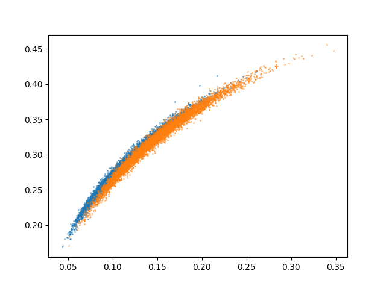

# CSE 575 作业，项目部分 1：密度估计和分类

## 简介

对于给定的数据集，我们有以下统计信息：

- 训练集中的样本数量： "7":6265 ;"8":5851
- 测试集中的样本数量："7":1028; "8":974

项目工程已上传至GitHub，请参考：https://github.com/jiang1991/cse575_assignment1

## 特征

你需要为每个图像提取以下两个特性：

1. 图像中所有像素值的平均值
2. 图像中所有像素值的标准偏差

我们假设这两个特性是独立的，并且每个图像（由 2 维特性向量表示）都是从 2 维正态分布中绘制的。

计算每个图像像素的均值和方差之后，将训练数据可视化，得到以下效果：



## 朴素贝叶斯

因为均值与方差都是连续变量，不能用离散变量的方法来计算概率。所以只能假设均值与方差都为正态分布，然后通过样本计算出正态分布的密度函数。这样就可以把训练数据带入，算出某一个点的密度函数值。

即：

```
# 根据贝叶斯计算标签为7或者8的概率
# p_7 = p(mean|7) x p(std|7) x p(7)
# p_8 = p(mean|8) x p(std|8) x p(8)
```

代码实现核心部分：

```python
# test
    right_sum = 0
    wrong_sum = 0
    for sample_i in range(2002):
        # sample_i = 200
        sample = tsX_new[sample_i, :]
        # print(sample, ts_Y[0][sample_i])
        # 分别求出7的概率与8的概率作比较
        p_7 = st.norm.pdf(sample[0], m_mean_7, m_std_7) * st.norm.pdf(sample[1], s_mean_7, s_std_7) * (6265 / 12116)
        p_8 = st.norm.pdf(sample[0], m_mean_8, m_std_8) * st.norm.pdf(sample[1], s_mean_8, s_std_8) * (5851 / 12116)
        if p_7 > p_8:
            predict = 0
        else:
            predict = 1

        if ts_Y[0][sample_i] == predict:
            right_sum += 1
        else:
            wrong_sum += 1

    print("right_sum, wrong_sum, right_rate")
    print(right_sum, wrong_sum, right_sum / 2002)
```

运行结果：


即朴素贝叶斯的准确率为69.5%

## 逻辑回归

逻辑回归的难点在于处理梯度上升最优参数

```python
# 梯度上升求最优参数
def grad_ascent(data, label):
    m, n = np.shape(data)
    alpha = 0.00001  # 设置梯度的阀值，该值越大梯度上升幅度越大
    max_cycles = 10000  # 设置迭代的次数，一般看实际数据进行设定，有些可能200次就够了
    weights = np.ones((n, 1))  # 设置初始的参数，并都赋默认值为1。

    for k in range(max_cycles):
        h = sigmoid(data * weights)
        error = (label - h)  # 求导后差值
        weights = weights + alpha * data.transpose() * error  # 迭代更新权重
    return weights
```

核心代码

```python
# 进行预测，并将预测评分存入 predict 列中
    predict = []
    test = np.mat(trX_new)
    for i in test:
        sig = sigmoid(i*np.mat(weight))
        # print("sig.shape")
        # print(sig.shape)
        if sig <= 0.6:
            predict.append('0')
        else:
            predict.append('1')

    # 计算预测准确率
    right_sum = 0
    wrong_sum = 0
    for i in range(12116):
        if int(trY[i][0]) == int(predict[i]):
            right_sum += 1
        else:
            wrong_sum += 1

    print("right_sum, wrong_sum, right_rate")
    print(right_sum, wrong_sum, right_sum / 12116)
```

运行结果

1. 迭代200次，准确率52%，跟瞎蒙没区别


2. 迭代300000次，准确率69.9%

   

## More

接下来如果需要提高准确率，我们会改进梯度上升方法以提高预测准确率，比如，改为随机梯度上升法。随机梯度上升法的思想是，每次只使用一个数据样本点来更新回归系数。这样就大大减小计算开销。

